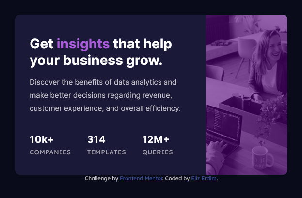

# Frontend Mentor - Stats preview card component solution

This is a solution to the [Stats preview card component challenge on Frontend Mentor](https://www.frontendmentor.io/challenges/stats-preview-card-component-8JqbgoU62). 

## Table of contents

- [Overview](#overview)
  - [The challenge](#the-challenge)
  - [Screenshot](#screenshot)
  - [Links](#links)
- [My process](#my-process)
  - [Built with](#built-with)
  - [What I learned](#what-i-learned)
  - [Continued development](#continued-development)
  - [Useful resources](#useful-resources)

## Overview

### The challenge

Users should be able to:

- View the optimal layout depending on their device's screen size

### Screenshot



### Links

- [View Code](https://github.com/elizerdim/stats-preview-card-component)
- [Live Preview](https://elizerdim.github.io/stats-preview-card-component/)

## My process

### Built with

- Semantic HTML5 markup
- CSS custom properties
- Flexbox
- Mobile-first workflow

### What I learned

For this project, I played around with the CSS filter property for quite some time to get the tint of the image right. I tried different combinations of opacity() contrast() brightness() grayscale() hue-rotate() saturate() with various values, so I got very familiar with all of them. In the end, I used the following combination:

```css
.stats-card figure::before {
    ...
    filter: opacity(.6) saturate(700%) brightness(45%) hue-rotate(-10deg) contrast(1.5);
    ...
}
```

The biggest challenge in this project was to make the layout look decent in mid-size screens (600px - 800px range). I finally decided to give more space to the content and crop the image by approximately half of its size to make it look good within this range. I'm pretty happy with the result.

### Continued development

Trying to make the layout look good for mid-size screens felt frustrating at first, but satisfying once I got it right. I had to come up with a slightly different design, which was not provided in the design files. I want to get more practice solving similar layout problems in future projects and get faster in coming up with solutions to them.

### Useful resources

- [CSS filter property](https://developer.mozilla.org/en-US/docs/Web/CSS/filter) - For adding graphical effects to images.  